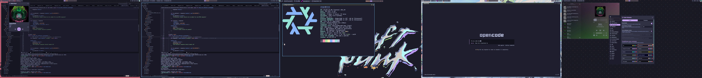

# Nixconf

## Applications

- Text Editor: [Zed](https://zed.dev)
- Browser: [Librewolf](https://librewolf.net)
- Terminal Emulator: [Kitty](https://sw.kovidgoyal.net/kitty/)
- Music Player: [Amberol](https://apps.gnome.org/Amberol/)

## Theme

Currently just using [Catppuccin](https://catppuccin.com/) wherever possible. I'm using
[Stylus](https://addons.mozilla.org/en-US/firefox/addon/styl-us/) and the
[userstyles](https://userstyles.catppuccin.com/getting-started/introduction/) to style some web
applications and sites like GitHub or YouTube.

Bootstrapped and inspired by [Vimjoyer](https://youtu.be/aNgujRXDTdE).

## Wallpapers

I made the Augustine wallpaper. Feel free to take it. The rest are all yoinked from various GitHub
repositories.
